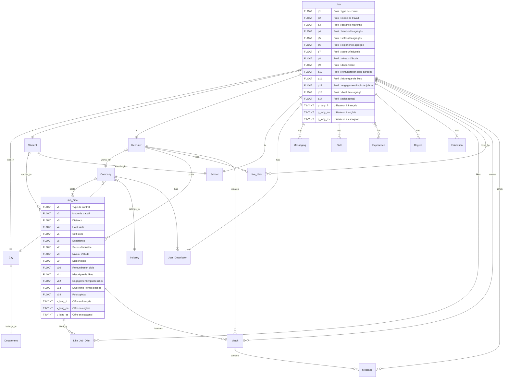

```mermaid
erDiagram

    City ||--|| Department : belongs_to

    User {
        FLOAT p1  "Profil : type de contrat"
        FLOAT p2  "Profil : mode de travail"
        FLOAT p3  "Profil : distance moyenne"
        FLOAT p4  "Profil : hard skills agrégés"
        FLOAT p5  "Profil : soft skills agrégés"
        FLOAT p6  "Profil : expérience agrégée"
        FLOAT p7  "Profil : secteur/industrie"
        FLOAT p8  "Profil : niveau d’étude"
        FLOAT p9  "Profil : disponibilité"
        FLOAT p10 "Profil : rémunération cible agrégée"
        FLOAT p11 "Profil : historique de likes"
        FLOAT p12 "Profil : engagement implicite (clics)"
        FLOAT p13 "Profil : dwell time agrégé"
        FLOAT p14 "Profil : poids global"
        TINYINT p_lang_fr "Utilisateur lit français"
        TINYINT p_lang_en "Utilisateur lit anglais"
        TINYINT p_lang_es "Utilisateur lit espagnol"
    }

    User }|--|| City : lives_in

    User ||--|| Student : is
    User ||--|| Recruiter : is
    User ||--|| School : is

    User ||--|{ User_Description : has
    User ||--|{ Messaging : has
    User ||--|{ Skill : has
    User }|--o{ Experience : has
    User ||--|{ Degree : has
    User ||--|{ Education : has

    Recruiter }|--|| Company : works_for
    Company ||--|{ Job_Offer : posts
    Recruiter ||--o{ Job_Offer : posts

    Student }|--o{ Job_Offer : applies_to
    Student }|--|| School : enrolled_in

    Job_Offer {
        FLOAT v1  "Type de contrat"
        FLOAT v2  "Mode de travail"
        FLOAT v3  "Distance"
        FLOAT v4  "Hard skills"
        FLOAT v5  "Soft skills"
        FLOAT v6  "Expérience"
        FLOAT v7  "Secteur/Industrie"
        FLOAT v8  "Niveau d’étude"
        FLOAT v9  "Disponibilité"
        FLOAT v10 "Rémunération cible"
        FLOAT v11 "Historique de likes"
        FLOAT v12 "Engagement implicite (clic)"
        FLOAT v13 "Dwell time (temps passé)"
        FLOAT v14 "Poids global"
        TINYINT v_lang_fr "Offre en français"
        TINYINT v_lang_en "Offre en anglais"
        TINYINT v_lang_es "Offre en espagnol"
    }

    Company }|--|| City : located_in
    Company }|--|| Industry : belongs_to
    Company ||--|{ User_Description : has

    User ||--o{ Like_Job_Offer : likes
    Job_Offer ||--o{ Like_Job_Offer : liked_by

    Recruiter ||--o{ Like_User : likes
    User ||--o{ Like_User : liked_by

    Recruiter ||--o{ Match : creates
    User ||--o{ Match : creates
    Job_Offer ||--o{ Match : involves

    Match ||--o{ Message : contains
    User ||--o{ Message : sends
```