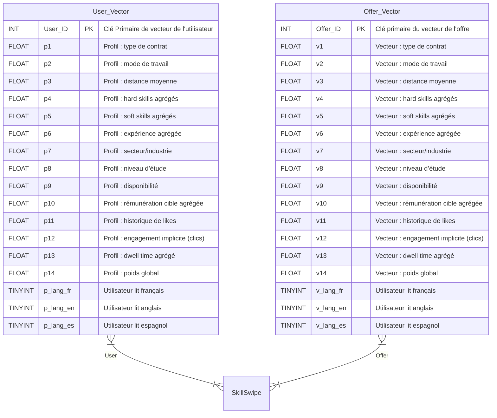

```mermaid
erDiagram

User_Vector {
  INT User_ID PK "Clé Primaire de vecteur de l'utilisateur"
  FLOAT p1 "Profil : type de contrat"
  FLOAT p2 "Profil : mode de travail"
  FLOAT p3 "Profil : distance moyenne"
  FLOAT p4 "Profil : hard skills agrégés"
  FLOAT p5 "Profil : soft skills agrégés"
  FLOAT p6 "Profil : expérience agrégée"
  FLOAT p7 "Profil : secteur/industrie"
  FLOAT p8 "Profil : niveau d’étude"
  FLOAT p9 "Profil : disponibilité"
  FLOAT p10 "Profil : rémunération cible agrégée"
  FLOAT p11 "Profil : historique de likes"
  FLOAT p12 "Profil : engagement implicite (clics)"
  FLOAT p13 "Profil : dwell time agrégé"
  FLOAT p14 "Profil : poids global"
  TINYINT p_lang_fr "Utilisateur lit français"
  TINYINT p_lang_en "Utilisateur lit anglais"
  TINYINT p_lang_es "Utilisateur lit espagnol"
}

Offer_Vector {
  INT Offer_ID PK "Clé primaire du vecteur de l'offre"
  FLOAT v1 "Vecteur : type de contrat"
  FLOAT v2 "Vecteur : mode de travail"
  FLOAT v3 "Vecteur : distance moyenne"
  FLOAT v4 "Vecteur : hard skills agrégés"
  FLOAT v5 "Vecteur : soft skills agrégés"
  FLOAT v6 "Vecteur : expérience agrégée"
  FLOAT v7 "Vecteur : secteur/industrie"
  FLOAT v8 "Vecteur : niveau d’étude"
  FLOAT v9 "Vecteur : disponibilité"
  FLOAT v10 "Vecteur : rémunération cible agrégée"
  FLOAT v11 "Vecteur : historique de likes"
  FLOAT v12 "Vecteur : engagement implicite (clics)"
  FLOAT v13 "Vecteur : dwell time agrégé"
  FLOAT v14 "Vecteur : poids global"
  TINYINT v_lang_fr "Utilisateur lit français"
  TINYINT v_lang_en "Utilisateur lit anglais"
  TINYINT v_lang_es "Utilisateur lit espagnol"
}

User_Vector }|--|{ SkillSwipe : User
Offer_Vector }|--|{ SkillSwipe : Offer

```