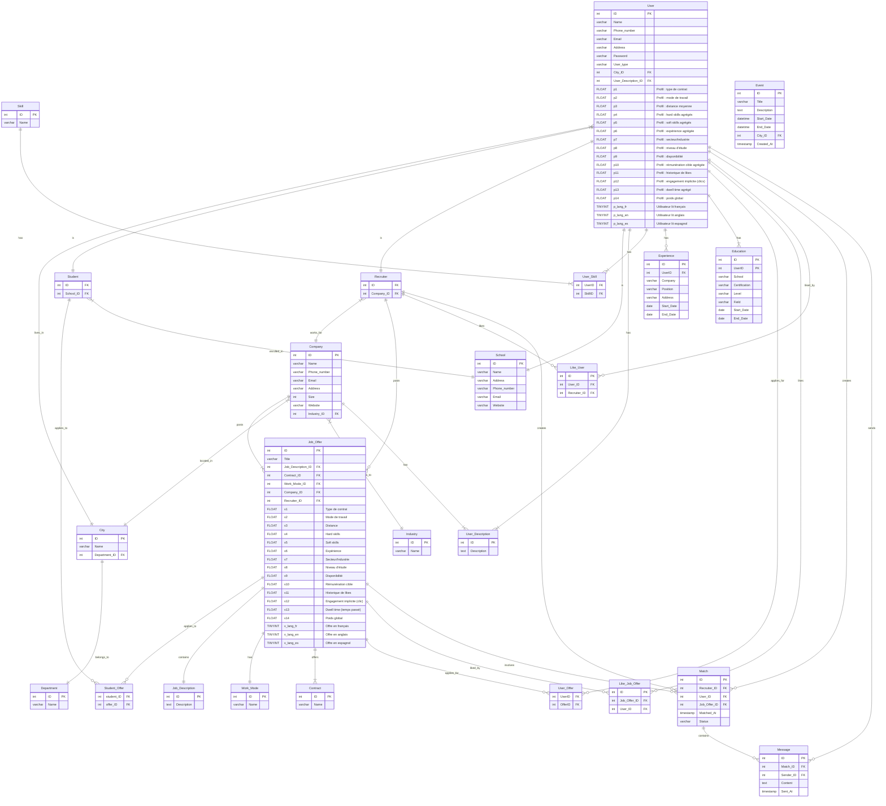

```mermaid
erDiagram

User {
  int ID PK
  varchar Name
  varchar Phone_number
  varchar Email
  varchar Address
  varchar Password
  varchar User_type
  int City_ID FK
  int User_Description_ID FK
  FLOAT p1        "Profil : type de contrat"
  FLOAT p2        "Profil : mode de travail"
  FLOAT p3        "Profil : distance moyenne"
  FLOAT p4        "Profil : hard skills agrégés"
  FLOAT p5        "Profil : soft skills agrégés"
  FLOAT p6        "Profil : expérience agrégée"
  FLOAT p7        "Profil : secteur/industrie"
  FLOAT p8        "Profil : niveau d’étude"
  FLOAT p9        "Profil : disponibilité"
  FLOAT p10       "Profil : rémunération cible agrégée"
  FLOAT p11       "Profil : historique de likes"
  FLOAT p12       "Profil : engagement implicite (clics)"
  FLOAT p13       "Profil : dwell time agrégé"
  FLOAT p14       "Profil : poids global"
  TINYINT p_lang_fr  "Utilisateur lit français"
  TINYINT p_lang_en  "Utilisateur lit anglais"
  TINYINT p_lang_es  "Utilisateur lit espagnol"
}

Company {
  int ID PK
  varchar Name
  varchar Phone_number
  varchar Email
  varchar Address
  int Size
  varchar Website
  int Industry_ID FK
}

Recruiter {
  int ID FK 
  int Company_ID FK
}

Student {
  int ID FK
  int School_ID FK
}

School {
  int ID PK
  varchar Name
  varchar Address
  varchar Phone_number
  varchar Email
  varchar Website
}

Job_Offer {
  int ID PK
  varchar Title
  int Job_Description_ID FK
  int Contract_ID FK
  int Work_Mode_ID FK
  int Company_ID FK
  int Recruiter_ID FK
  FLOAT v1        "Type de contrat"
  FLOAT v2        "Mode de travail"
  FLOAT v3        "Distance"
  FLOAT v4        "Hard skills"
  FLOAT v5        "Soft skills"
  FLOAT v6        "Expérience"
  FLOAT v7        "Secteur/Industrie"
  FLOAT v8        "Niveau d’étude"
  FLOAT v9        "Disponibilité"
  FLOAT v10       "Rémunération cible"
  FLOAT v11       "Historique de likes"
  FLOAT v12       "Engagement implicite (clic)"
  FLOAT v13       "Dwell time (temps passé)"
  FLOAT v14       "Poids global"
  TINYINT v_lang_fr  "Offre en français"
  TINYINT v_lang_en  "Offre en anglais"
  TINYINT v_lang_es  "Offre en espagnol"
}

City {
  int ID PK
  varchar Name
  int Department_ID FK
}

Department {
  int ID PK
  varchar Name
}

Industry {
  int ID PK
  varchar Name
}

Job_Description {
  int ID PK
  text Description
}

User_Description {
  int ID PK
  text Description
}

Contract {
  int ID PK
  varchar Name
}

Work_Mode {
  int ID PK
  varchar Name
}

Skill {
  int ID PK
  varchar Name
}

Education {
  int ID PK
  int UserID PK
  varchar School
  varchar Certification
  varchar Level
  varchar Field
  date Start_Date
  date End_Date
}

Experience {
  int ID PK
  int UserID FK
  varchar Company
  varchar Position
  varchar Address
  date Start_Date
  date End_Date
}

Message {
  int ID PK
  int Match_ID FK
  int Sender_ID FK
  text Content
  timestamp Sent_At
}

Event {
  int ID PK
  varchar Title
  text Description
  datetime Start_Date
  datetime End_Date
  int City_ID FK
  timestamp Created_At
}

Like_Job_Offer {
  int ID PK
  int Job_Offer_ID FK
  int User_ID FK
}

Like_User {
  int ID PK
  int User_ID FK
  int Recruiter_ID FK
}

Match {
  int ID PK
  int Recruiter_ID FK
  int User_ID FK
  int Job_Offer_ID FK
  timestamp Matched_At
  varchar Status
}

User_Skill{
  int  UserID FK
  int  SkillID FK
}

Student_Offer{
    int student_ID FK
    int offer_ID FK
}

User_Offer{
    int UserID FK
    int OfferID FK
}

City ||--|| Department : belongs_to
User }|--|| City : lives_in

User ||--|| Student : is
User ||--|| Recruiter : is
User ||--|| School : is

User ||--|{ User_Description : has
User ||--|{ User_Skill : has
Skill ||--|{ User_Skill : has
User ||--o{ Experience : has
User ||--|{ Education : has

Recruiter }|--|| Company : works_for
Company ||--|{ Job_Offer : posts
Recruiter ||--o{ Job_Offer : posts

Student ||--o{ Student_Offer : applies_to
Job_Offer ||--o{ Student_Offer : applies_to
Student }|--|| School : enrolled_in

Job_Offer ||--|| Job_Description : contains
Job_Offer ||--|| Work_Mode : has
Job_Offer ||--|{ Contract : offers
User ||--o{ User_Offer : applies_for
Job_Offer ||--o{ User_Offer : applies_for

Company }|--|| City : located_in
Company }|--|| Industry : belongs_to
Company ||--|{ User_Description : has

User ||--o{ Like_Job_Offer : likes
Job_Offer ||--o{ Like_Job_Offer : liked_by

Recruiter ||--o{ Like_User : likes
User ||--o{ Like_User : liked_by

Recruiter ||--o{ Match : creates
User ||--o{ Match : creates
Job_Offer ||--o{ Match : involves

Match ||--o{ Message : contains
User ||--o{ Message : sends

```
